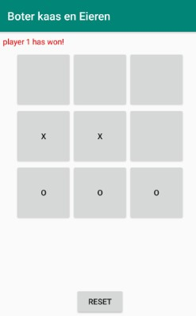

# Ticta# Tictactoe

Ik heb TicTacToe gemaakt. Waarbij wordt aangegeven of player 1 of player 2 gewonnnen heeft.
Of dat het een draw is. De knoppen kunnen niet meer ingedrukt worden als er gewonnen is

Hij onthoud alles als hij omgedraaid wordt. 

Ik heb ook het icon van de app veranderd.

